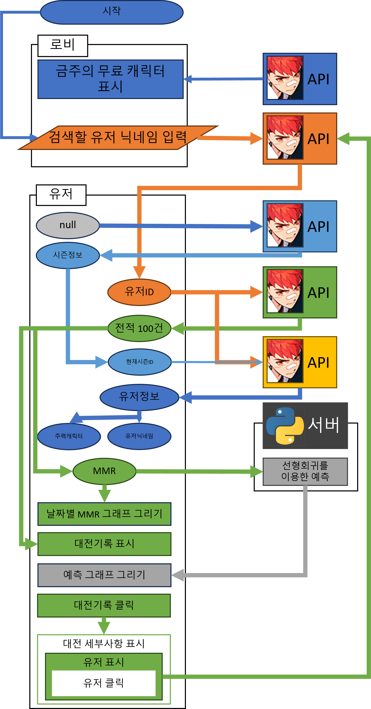
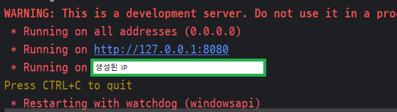

# 그님티 
#### 이터널리턴 티어 예측 어플리케이션

## 목차
1. [이터널리턴 이란?](#1-이터널리턴-이란)
2. [어쩌다 만들었는가](#2-어쩌다-만들었는가)
3. [시연영상](#3-시연영상)
4. [이터널리턴 OpenAPI](#4-이터널리턴-openapi-link)
5. [사용방법](#5-사용방법)
   - [작업도구](#--작업도구)
   - [설치 및 실행](#--설치-및-실행)
6. [주요 기능](#6-주요-기능)
7. [라이센스](#7-라이센스)
8. [참고문헌](#8-참고문헌)

### 1. 이터널리턴 이란?
[<u>이터널리턴</u>](https://playeternalreturn.com/main?hl=ko-KR)
 
- 넵튠의 자회사 님블뉴런에서 만든 쿼터뷰 배틀로얄
- 게임당 최대 24명의 플레이어가 참여하여 파밍한 물품들을
이용해 장비와 음식을 만들고 활용하는 배틀로얄, 다양한 전략으로 
최후의 1팀을 가려내는 게임

### 2. 어쩌다 만들었는가
- 평소에 이터널리턴을 즐김
   

   
제작자의 이터널리턴 사랑

  
   - 제작자의 플레이어 레벨 
   - 제작자의 플레이타임 
   - 제작자의 프로필 
   

- [이터널리턴 Open API](https://developer.eternalreturn.io/):link:의 존재를 알게됨
- 뭔가 자신감이 생김

### 3. 시연영상 (업로드 예정)

[시연영상 보러가기 Youtube](https://youtu.be/Sjv30tWRXpQ):link:

### 4. [이터널리턴 OpenAPI](https://developer.eternalreturn.io/) :link:
 
[이터널리턴 개발자 포털 ](https://developer.eternalreturn.io/):link:  
 
[이터널리턴 개발자 디스코드](https://discord.com/invite/b4XxYet2qk):link:

### 5. 사용방법
#### - 작업도구
1. [안드로이드 스튜디오(Giraffe)](https://developer.android.com/studio?hl=ko):link:
2. [파이참(2023.2.3)](https://www.jetbrains.com/ko-kr/pycharm/download/?section=windows):link:
3. [네이버 클라우드](https://www.ncloud.com/):link:

#### - 설치 및 실행
###### 안드로이드 스튜디오 내에서 실행 (API 31 이상의 기기 필요)

1. 가상머신으로 실행하기

   - Virtual Device : Nexus 5 API 34(추천)
   - [안드로이드 스튜디오 가상머신 만들기](https://developer.android.com/studio/run/managing-avds?hl=ko) 참고 :link:
   - 가상머신 전원 켜기 
   - 실행 버튼 누르기 
   - 성공적 실행! 

2. 모바일 기기에서 실행하기

   - [모바일 기기 연결하기](https://developer.android.com/studio/run/device?hl=ko):link:
       
   - 성공적 연결!(시스템 테마 : dark) 

###### apk를 이용해서 설치하기

1. apk를 이용해 설치하기

  - 프로젝트 수정 시 [apk빌드하기](https://learn2you.tistory.com/82):link:
  - ERHistoryViewer\ERHistoryViewer\app\release\app-release.apk 생성
  - 모바일 기기에서 apk파일 설치

### 6. 주요 기능

흐름도 전체 보기

##### 클라이언트 (어플리케이션)
- 닉네임으로 유저찾기(닉네임 -> 유저ID)
- 시즌 정보 받아오기
- 유저ID로 유저 정보 불러오기
    + 유저 닉네임 (대소문자가 구별된 진짜 닉네임)
    + 유저 순위 (상위 n%)
    + 주력 캐릭터
- 유저ID로 최근 200건의 전적 불러오기
    + 랭크, 일반, 코발트로 모드 분류
    + 모드별 전적 표시
- MMR그래프 표시
    + 현 시즌 랭크게임의 날짜별 MMR 변동 그래프
- MMR 예측그래프 표시
    + [Python서버](#파이썬-서버)를 이용한 시즌 종료일까지의 MMR추세 그래프 
- 전적 상세 보기
    + 해당 게임의 플레이어 표시
    + 플레이어 즉시 검색

##### 파이썬 서버
- 클라이언트로 부터 MMR 획득
- 선형회귀를 이용한 MMR 추이선 생성
- 날짜별 예측 MMR 반환
- :warning: 해당 서버는 2024일 12월경에 만료될 예정 (예측 그래프 외 모두 정상 작동)
    

    
로컬에서 서버 실행하기

    - ERHistoryViewer/python/MMRPredictor.py실행
      
    - [생성된 IP]를 크롬 주소창에 입력했을 때 "Upload mmr success"출력시 정상 작동 상태
    - 안드로이드 스튜디오 내 thd_Request.java 파일의 serverURL을 [생성된IP]로 변경
    

### 7. 라이센스

Copyright 2020 Philipp Jahoda

Licensed under the Apache License, Version 2.0 (the "License"); you may not use this file except in compliance with the License. You may obtain a copy of the License at

http://www.apache.org/licenses/LICENSE-2.0

Unless required by applicable law or agreed to in writing, software distributed under the License is distributed on an "AS IS" BASIS, WITHOUT WARRANTIES OR CONDITIONS OF ANY KIND, either express or implied. See the License for the specific language governing permissions and limitations under the License.

### 8. 참고문헌
#### 영감
- [닥지지-전적검색사이트](https://dak.gg/er):link:
#### 이터널리턴
- [이터널리턴 공식 홈페이지](https://playeternalreturn.com/main?hl=ko-KR):link:
- [이터널리턴 개발자 포털](https://developer.eternalreturn.io/):link:
- [이터널리턴 팬키트](https://drive.google.com/drive/folders/1bgW32L09YPpRgQKtH4C_TAd3Kr0N9Y90):link:
- [나무위키-이터널리턴](https://namu.wiki/w/%EC%9D%B4%ED%84%B0%EB%84%90%20%EB%A6%AC%ED%84%B4#s-1):link:
#### 안드로이드 스튜디오
- [안드로이드 스튜디오 꺾은선 그래프 만들기](https://stickode.tistory.com/363):link:
- [안드로이드 스튜디오 HttpURLConnection](https://android-uni.tistory.com/9):link:
- [안드로이드 스튜디오 Thread 사용방법](https://itmining.tistory.com/4):link:
- [자바 csv파일 입출력](https://bibi6666667.tistory.com/200):link:
- [안드로이드 스튜디오 abb 빌드하기](https://samgupsal.tistory.com/35):link:
- [안드로이드 스튜디오 apk 빌드하기](https://learn2you.tistory.com/82):link:
#### 서버
- [우분투 가상환경 만들기](https://ssilook.tistory.com/entry/%EA%B0%80%EC%83%81%ED%99%98%EA%B2%BD-%EC%9A%B0%EB%B6%84%ED%88%ACUbuntu-%EA%B0%80%EC%83%81%ED%99%98%EA%B2%BD-%EB%A7%8C%EB%93%A4%EA%B8%B0):link:
- [우분투 백그라운드 프로세스 실행](https://bongjacy.tistory.com/entry/%EB%B0%B1%EA%B7%B8%EB%9D%BC%EC%9A%B4%EB%93%9C%EC%97%90%EC%84%9C-%ED%8C%8C%EC%9D%B4%EC%8D%AC-%EC%8B%A4%ED%96%89%ED%95%98%EB%8A%94-%EB%B0%A9%EB%B2%95):link:
#### 기타
- [EASYME.md 리드미 작성툴](https://www.easy-me.com/d#link):link:

### ?. 이스터에그
 
하트를 쓰다듬어 주세요(앱에서)

